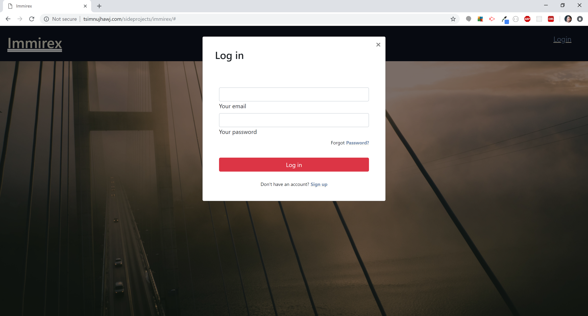

# Immirex
Immirex is a database application that helps immigration and application specialists complete USCIS forms.

## Demo
You can find a demo [here](http://tsimnujhawj.com/sideprojects/immirex/)

## Authors
* Tsimnuj Hawj - Developer/Creator - [Tsimnuj Hawj](https://github.com/tsimnujhawj)

## Development Notes
This is just a simple HTML/CSS and JavaScript scheme of what is to come. The tentative plan is to utilize React.js's powerful module and virtual DOM as the view engine with an Express server and MongoDB database to hold client information.
